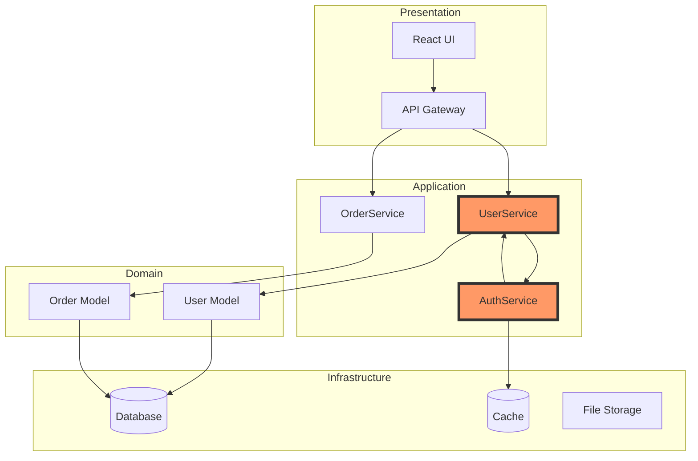

# Sub-Agent Architecture Reviewer Command

Analyzes system architecture, detects violations, suggests improvements, and generates visual documentation using multiple specialized sub-agents.

## Command Syntax

```bash
sub-agent-architecture-reviewer [target] [options]

# Aliases
@architecture-review [target] [options]
@arch-review [target] [options]
@saar [target] [options]
```

## Parameters

- `target` - Directory to analyze (defaults to current directory)
- `--visualize` - Generate architecture diagrams (default: true)
- `--detect-violations` - Check for architecture anti-patterns
- `--suggest-improvements` - Provide refactoring suggestions
- `--style` - Architecture style (layered, hexagonal, microservices, mvc)
- `--output` - Output format (text, markdown, mermaid, plantuml)
- `--depth` - Analysis depth (shallow, standard, deep)
- `--rules` - Custom architecture rules file

## Examples

```bash
# Basic architecture review
@architecture-review

# Full analysis with violations
@arch-review src/ --detect-violations --suggest-improvements

# Generate diagrams for specific style
@architecture-review --style hexagonal --visualize --output mermaid

# Check against custom rules
@arch-review . --rules .architecture-rules.yaml
```

## Agent Orchestration

### Stage 1: Analysis Agents (Parallel)

#### Agent 1: Dependency Mapper
```
Map all dependencies in [TARGET]

Tasks:
1. File Dependencies:
   - Import/require statements
   - Dynamic imports
   - Lazy loading patterns
   - Circular dependencies

2. Package Dependencies:
   - Direct dependencies
   - Transitive dependencies
   - Version conflicts
   - Unused packages

3. Layer Dependencies:
   - Cross-layer references
   - Proper layer isolation
   - Dependency direction
   - Interface boundaries

4. Service Dependencies:
   - API dependencies
   - Database connections
   - External services
   - Message queues

Return:
- Dependency graph data
- Circular dependency list
- Layer violation report
- Service coupling metrics
```

#### Agent 2: Pattern Analyzer
```
Analyze architectural patterns in [TARGET]

Tasks:
1. Design Patterns:
   - Repository pattern usage
   - Service layer implementation
   - Factory patterns
   - Observer patterns
   - Strategy patterns

2. Architecture Style:
   - MVC compliance
   - Hexagonal architecture
   - Clean architecture
   - Domain-driven design
   - Microservices patterns

3. Code Organization:
   - Module boundaries
   - Package structure
   - Naming conventions
   - Folder organization

4. Framework Patterns:
   - React: Container/Presentational
   - Laravel: Service providers
   - WordPress: Plugin architecture
   - Cloudflare: Worker patterns

Return:
- Pattern usage report
- Style compliance score
- Organization assessment
- Best practice adherence
```

#### Agent 3: Complexity Analyzer
```
Analyze architectural complexity in [TARGET]

Tasks:
1. Structural Complexity:
   - Component coupling
   - Cohesion metrics
   - Abstraction levels
   - Interface complexity

2. Data Flow Complexity:
   - Data transformation layers
   - State management
   - Event flows
   - Message passing

3. Integration Complexity:
   - API surface area
   - External dependencies
   - Database complexity
   - Service interactions

4. Cognitive Complexity:
   - Understanding difficulty
   - Onboarding complexity
   - Documentation needs
   - Mental model clarity

Return:
- Complexity hotspots
- Simplification opportunities
- Refactoring priorities
- Cognitive load assessment
```

### Stage 2: Synthesis Agent

```
Synthesize architecture analysis from all agents: [ANALYSIS_RESULTS]

Tasks:
1. Architecture Overview:
   - Current architecture style
   - Key components and layers
   - Integration points
   - Technology stack summary

2. Violation Detection:
   - Layer violations
   - Circular dependencies
   - Anti-patterns
   - Style inconsistencies

3. Quality Metrics:
   - Coupling/cohesion scores
   - Maintainability index
   - Technical debt assessment
   - Architecture fitness

4. Improvement Roadmap:
   - Priority improvements
   - Refactoring strategies
   - Migration paths
   - Quick wins

Generate:
- Architecture documentation
- Violation report
- Improvement roadmap
- Visual diagrams
```

### Stage 3: Visualization Agent

```
Generate architecture visualizations from synthesis: [ARCHITECTURE_DATA]

Diagrams to Generate:
1. Component Diagram:
   - High-level components
   - Dependencies
   - Interfaces
   - External systems

2. Layer Diagram:
   - Architecture layers
   - Layer boundaries
   - Allowed dependencies
   - Violations highlighted

3. Sequence Diagrams:
   - Key workflows
   - Service interactions
   - Data flows
   - API calls

4. Deployment Diagram:
   - Infrastructure layout
   - Service locations
   - Network boundaries
   - Scaling points

Output formats:
- Mermaid diagrams
- PlantUML
- ASCII art
- SVG/PNG exports
```

## Output Examples

### Architecture Overview (Markdown)
```markdown
# Architecture Analysis Report

## Overview
- **Style**: Hexagonal Architecture with DDD
- **Layers**: 4 (Presentation, Application, Domain, Infrastructure)
- **Components**: 23 major components
- **Health Score**: 78/100

## Key Findings
### ✅ Strengths
- Clear domain boundaries
- Good service abstraction
- Consistent patterns

### ⚠️ Violations
1. **Layer Violation**: DirectDB access from Controller (3 instances)
2. **Circular Dependency**: UserService ↔ AuthService
3. **God Class**: OrderService (500+ lines, 15 dependencies)

## Improvement Roadmap
1. Extract OrderService into smaller services (2 days)
2. Fix circular dependencies (1 day)
3. Move DB access to repositories (1 day)
```

### Mermaid Component Diagram


## Architecture Rules Configuration

### .architecture-rules.yaml
```yaml
rules:
  layers:
    - name: Presentation
      allowedDependencies: [Application]
      forbidden: [Infrastructure, Database]
    
    - name: Application
      allowedDependencies: [Domain]
      forbidden: [Infrastructure.Database]
    
    - name: Domain
      allowedDependencies: []
      forbidden: [Application, Presentation, Infrastructure]
    
    - name: Infrastructure
      allowedDependencies: [Domain]
      forbidden: [Application, Presentation]
  
  complexity:
    maxComponentDependencies: 7
    maxLayerDepth: 4
    maxCircularDependencies: 0
  
  patterns:
    required: [Repository, Service]
    forbidden: [Singleton, GlobalState]
```

## Integration Examples

### VS Code Extension
```json
{
  "command": "claude.architectureReview",
  "title": "Review Architecture",
  "key": "cmd+shift+a"
}
```

### CI/CD Pipeline
```yaml
architecture-check:
  script:
    - @architecture-review --detect-violations
    - if [ $? -ne 0 ]; then exit 1; fi
  artifacts:
    paths:
      - architecture-report.md
      - diagrams/
```

### Git Hook
```bash
#!/bin/bash
# Check architecture before merge
@architecture-review --quick --detect-violations
```

## Best Practices

1. **Regular Reviews**: Run monthly architecture reviews
2. **Track Metrics**: Monitor architecture health score
3. **Document Decisions**: Use ADRs (Architecture Decision Records)
4. **Automate Checks**: Add to CI/CD pipeline
5. **Visualize Changes**: Generate diagrams for PRs
6. **Define Rules**: Create project-specific architecture rules